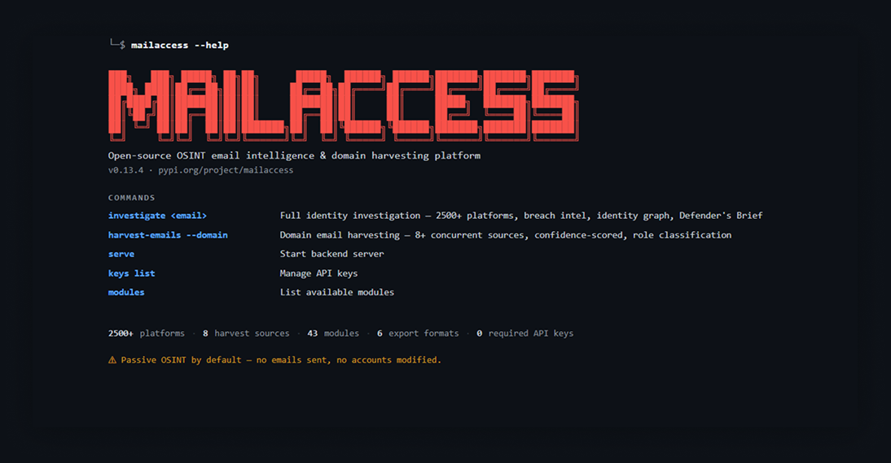
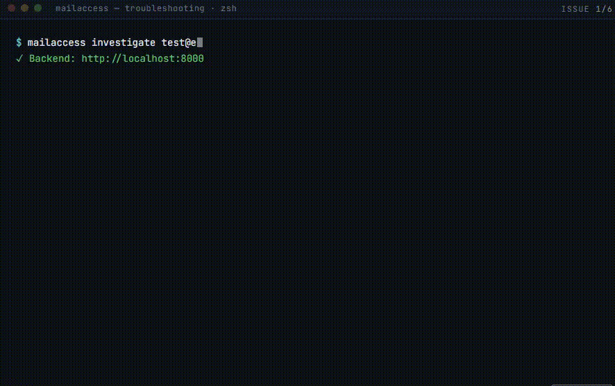

<pre align="center">
███╗   ███╗ █████╗ ██╗██╗      █████╗  ██████╗ ██████╗███████╗███████╗███████╗
████╗ ████║██╔══██╗██║██║     ██╔══██╗██╔════╝██╔════╝██╔════╝██╔════╝██╔════╝
██╔████╔██║███████║██║██║     ███████║██║     ██║     █████╗  ███████╗███████╗
██║╚██╔╝██║██╔══██║██║██║     ██╔══██║██║     ██║     ██╔══╝  ╚════██║╚════██║
██║ ╚═╝ ██║██║  ██║██║███████╗██║  ██║╚██████╗╚██████╗███████╗███████║███████║
╚═╝     ╚═╝╚═╝  ╚═╝╚═╝╚══════╝╚═╝  ╚═╝ ╚═════╝ ╚═════╝╚══════╝╚══════╝╚══════╝
</pre>

[](LICENSE)
[](https://www.python.org/)
[](docker-compose.yml)
[](https://pypi.org/project/mailaccess/)
[](https://pypi.org/project/mailaccess/)

Self-hostable OSINT platform for investigating email addresses. Fan out across breach databases, social networks, DNS records, and the open web — get back a unified exposure score and structured findings you can export or pipe into Maltego.

Built for security researchers, OSINT analysts, and penetration testers operating under authorization. Read [DISCLAIMER.md](DISCLAIMER.md) before use.

## Terminal Output



## Install

```bash
pip install mailaccess
mailaccess investigate you@example.com
```

The CLI auto-starts and stops the backend for each investigation. Use
`mailaccess serve` when you want a persistent server, or install
`mailaccess[ml]` for optional spaCy-based name classification.

Full install options (Docker, persistent server, self-hosting) -> [docs/self-hosting.md](docs/self-hosting.md).

## Quick Start

```bash
mailaccess investigate you@example.com
mailaccess investigate you@example.com -o report.pdf
mailaccess harvest-emails --domain company.com
mailaccess harvest-emails --domain company.com --export harvest.csv
mailaccess keys set HIBP_API_KEY your-key
mailaccess keys list
mailaccess serve
mailaccess modules
```

Pipeline, stdin, JSONL, and CI examples -> [docs/integrations.md](docs/integrations.md#pipeline-integration).


## What It Does

- **Identity graph** - cross-platform correlation of accounts, usernames, names, avatars, breach data, and profile links.
- **Name Consensus Engine** - synthesizes independent name signals into confirmed, probable, possible, or unknown identity bands.
- **Defender's Brief** - security-manager-ready risk summary with prioritized findings and a concrete next action.
- **Domain email harvesting** - `harvest-emails` discovers organization addresses across Common Crawl, GitHub, CT logs, registries, keyservers, dorks, employee pages, and patterns.
- **2500+ platform coverage** - native Maigret engine plus Sherlock, Nexfil, Blackbird, WhatsMyName, Holehe, and user-scanner coverage.
- **Deep breach mode** - probes the highest-severity breach corpus for account-existence risk.
- **Credential Risk Score** - separate 0-100 credential exposure band with top drivers and recommended next steps.
- **6 export formats** - JSON, CSV, PDF, Markdown, STIX 2.1, and Maltego XML.

## Identity Graph

Every investigation builds an identity graph linking accounts by shared usernames, photos, display names, and breach data. View it at `/investigation/:id/graph`, export it with `GET /api/report/{id}/graph`, or read the full model in [docs/modules.md](docs/modules.md).

## Name Consensus Engine

MailAccess collects name signals from profile modules and returns a defensible identity summary:

```text
CONFIRMED IDENTITY
  Name:     Katriel Moses  [CONFIRMED]
  Sources:  GitHub . Gravatar . Keybase . PGP
  Reasoning: 4 independent sources agree.
```

Full confidence rules and source behavior -> [docs/modules.md](docs/modules.md).

## Defender's Brief

Every investigation includes a 30-second risk summary designed for security managers:

```text
DEFENDER'S BRIEF
  Risk:    CRITICAL
  Summary: Active infostealer infection detected.
  1. Active credential theft   [CRITICAL]
     -> Rotate credentials immediately.
  Next action: Immediately rotate credentials and enforce hardware MFA.
```

Suppress it with `--no-brief`; full details live in [docs/modules.md](docs/modules.md).

## Modules

64 modules, 2500+ platforms by default. Full module reference -> [docs/modules.md](docs/modules.md).

## API Keys

Most modules work with zero keys. Optional keys unlock more coverage. Full list -> [docs/api-keys.md](docs/api-keys.md).

## Export Formats

Save reports as JSON, CSV, PDF, Markdown, STIX 2.1, or Maltego XML with `-o`. Full export reference -> [docs/exports.md](docs/exports.md).

## Integrations

Use Maltego, Slack, Discord, generic webhooks, JSONL pipelines, and CI workflows. Full integration guide -> [docs/integrations.md](docs/integrations.md).

## Self-Hosting

Run the CLI locally or launch the full web stack with Docker Compose. Full guide -> [docs/self-hosting.md](docs/self-hosting.md).

## Changelog

See [CHANGELOG.md](CHANGELOG.md) for release history.

## Troubleshooting



## Links

| | |
|-|-|
| [Self-hosting guide](docs/self-hosting.md) | Docker Compose, `.env` reference, PostgreSQL, proxy/Tor, Maltego setup |
| [Module reference](docs/modules.md) | All modules, findings schema, adding new modules |
| [False-positive controls](docs/fp-control.md) | Common-name, disposable-domain, clustering, health, and scoring controls |
| [API reference](docs/api.md) | REST endpoints, WebSocket events, authentication |
| [Export formats](docs/exports.md) | Supported formats, MIME types, filename conventions |
| [Integrations](docs/integrations.md) | Maltego, Slack, Discord, generic webhooks |
| [Contributing](CONTRIBUTING.md) | Adding modules, adding exporters, code style, PR checklist |
| [PyPI](https://pypi.org/project/mailaccess/) | `pip install mailaccess` |
| [GitHub](https://github.com/YOUR_USERNAME/mailaccess) | Source code, issues, releases |

## License

MIT. All data queried by MailAccess comes from public sources. See [DISCLAIMER.md](DISCLAIMER.md) for authorized use cases and legal responsibility.
