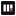
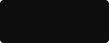

<a href="../README.md">
  <picture>
    <source media="(prefers-color-scheme: dark)" srcset="../assets/brand/mailaccess-logo-reversed.svg">
    
  </picture>
</a>

# Brand

Identity kit v1 — 13 assets. Everything here is vector, drawn as paths, with no font or network dependency. Source files live in [`assets/brand/`](../assets/brand).

---

## Lockups

**01 · Primary horizontal.** The default. Icon and wordmark share cap height.

**02 · Stacked.** For square-ish spaces where the horizontal lockup would set too small.

**03 · Reversed.** Dark UI only. The seal switches to `#D8455A` — `#8A1C2B` is too dark to hold on near-black.

**04 · Single colour.** All near-black. Print, embroidery, faxable docs, anywhere the accent cannot survive.

**05 · Single colour accent.** All maroon. Use sparingly — never next to 01.

**06 · Wordmark.** Jost, 500/400 weight break between `mail` and `access`, tracking −0.04em.

---

## Profile & app marks

| | | | |
|:-:|:-:|:-:|:-:|
|  |  |  |  |
| **07** · social 400 | **08** · avatar light | **09** · app icon | **10** · app icon alt |

---

## Favicons

Progressively simplified — the mark is redrawn at each size, not scaled down.

| | | |
|:-:|:-:|:-:|
|  |  |  |
| **11 · 64px** — full mark | **12 · 32px** — heavier strokes, single seal bar | **13 · 16px** — three bars, accent block |

---

## Palette

Three colours. Nothing else.

| | Name | Hex | Role |
|-|------|-----|------|
|  | **near-black** | `#0D0D0D` | Structure. The mark, the wordmark, body text. |
|  | **maroon** | `#8A1C2B` | Risk. **One element only** — never a second maroon element in the same view. |
|  | **maroon (dark UI)** | `#D8455A` | The maroon, lifted for near-black backgrounds. Same job, same one-element rule. |
|  | **cool gray** | `#9AA0A6` | Support — labels, rules, secondary text. Never the mark. |

Supporting surfaces used in the kit: `#FAFAFA` (light panel), `#F2F2F3` (chip), `#E9E9EB` (rules), `#6E747A` (mono label).

---

## Typography

| Face | Use | Setting |
|------|-----|---------|
| **Jost** | Wordmark, headings | `mail` at 500, `access` at 400; tracking −0.04em |
| **IBM Plex Mono** | Labels, captions, metadata | Uppercase, tracking 0.18–0.22em, colour `#6E747A` |

The shipped lockups have the wordmark converted to outlines, so **nothing needs Jost installed to render correctly**.

---

## Clearspace

Minimum clearspace is **½ the mark height** on all four sides. Nothing enters that box — no text, no rules, no other logos.

---

## Rules

- Use **01** unless there is a reason not to.
- On near-black, use **03** — not 01 with the background knocked out.
- Never recolour the mark outside the four lockups above.
- Never add a second maroon element to a view. The accent marks risk; two accents mark nothing.
- Never stretch, rotate, outline, or add effects to the mark.
- Never rebuild the wordmark by typing `mailaccess` in Jost — the shipped outlines carry the tracking and weight break.

---

## Files

| File | Asset |
|------|-------|
| [`mailaccess-logo.svg`](../assets/brand/mailaccess-logo.svg) | 01 · primary horizontal |
| [`mailaccess-logo-stacked.svg`](../assets/brand/mailaccess-logo-stacked.svg) | 02 · stacked |
| [`mailaccess-logo-reversed.svg`](../assets/brand/mailaccess-logo-reversed.svg) | 03 · reversed, dark UI |
| [`mailaccess-logo-mono.svg`](../assets/brand/mailaccess-logo-mono.svg) | 04 · single colour |
| [`mailaccess-logo-accent.svg`](../assets/brand/mailaccess-logo-accent.svg) | 05 · single colour accent |
| [`mailaccess-wordmark.svg`](../assets/brand/mailaccess-wordmark.svg) | 06 · wordmark |
| [`mailaccess-avatar-dark.svg`](../assets/brand/mailaccess-avatar-dark.svg) | 07 · social 400 |
| [`mailaccess-avatar-light.svg`](../assets/brand/mailaccess-avatar-light.svg) | 08 · avatar light |
| [`mailaccess-icon.svg`](../assets/brand/mailaccess-icon.svg) | 09 · app icon |
| [`mailaccess-icon-accent.svg`](../assets/brand/mailaccess-icon-accent.svg) | 10 · app icon alt |
| [`favicon-64.svg`](../assets/brand/favicon-64.svg) | 11 · 64px |
| [`favicon-32.svg`](../assets/brand/favicon-32.svg) | 12 · 32px |
| [`favicon-16.svg`](../assets/brand/favicon-16.svg) | 13 · 16px |

Press and sponsor enquiries: see [SPONSORSHIP.md](../SPONSORSHIP.md).
